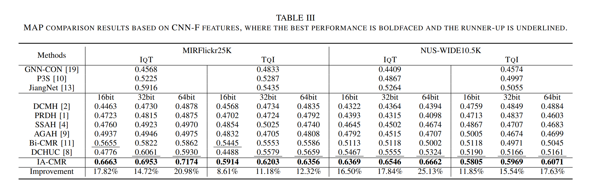

# Alleviating the Inconsistency of Multimodal Data in Cross-Modal Retrieval

## Requirments
- `python==3.5`
- `pytorch==0.6.2`
- `CUDA==9.0`
- `cuDNN==7.0.5`

## Usage
1. Install required packages.
2. Download required datasets, and unzip the zip file in the data.
3. run <code>python /data/mirflickr25k/mir_deal.py</code> to obtain 'txt_database.npy'. run <code>python ./run.py</code> to train and evaluate DCMR on MIRFlickr25K. NUS-WIDE is also refers to these operations.

## Datasets and pretrain model
- The datasets used in our paper are orgnized in [data/](data/), where each dataset contains the image list, multi-label list, txt list and truth relevant pair.
- The images in the MIRFlickr25K is dowload from http://press.liacs.nl/mirflickr/mirdownload.html, original images in NUS-WIDE10.5K is download from https://lms.comp.nus.edu.sg/wp-content/uploads/2019/research/nuswide/NUS-WIDE.html.
- The Evaluation metric of all the method is same as Bi-CMR and AGAH. 
- The CNN-F model is same as DCMH.
- The CLIP model is same as https://github.com/mlfoundations/open_clip.

## Results

The training logs for each dataset are avalible in [log/](log/).

## code for other baselines
- DCMH: https://github.com/WendellGul/DCMH 
- PRDH: Coded according to the original paper (no open source code)
- SSAH: https://github.com/zyfsa/cvpr2018-SSAH
- AGAH: https://github.com/WendellGul/AGAH
- Bi-CMR: https://github.com/lty4869/Bi-CMR
- GNN-CON: Coded according to the original paper (no open source code)
- P3S: Coded according to the original paper (no open source code)
- JiangNet: Coded according to the original paper (no open source code)
- DCHUC: https://github.com/rongchengtu1/DCHUC
